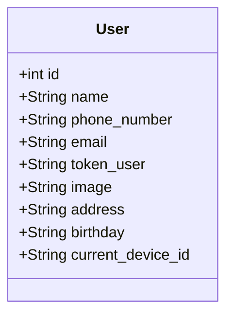

# TrackAsia TMS Client API – Kế hoạch tích hợp & tài liệu tham chiếu

> **Mục tiêu tài liệu**  
> Cung cấp một bộ hướng dẫn tích hợp cho đối tác khi kết nối nhóm API *Client* của TrackAsia TMS. Tài liệu tập trung vào **đặc tả API**, **mô hình dữ liệu**, **quy trình triển khai**, **tiêu chuẩn bảo mật**, kèm **hình minh họa** đã chuẩn bị sẵn


## 1) Phạm vi & nguyên tắc
- **Base URL (prod)**: `https://tms.track-asia.com/api/v1`
- **Module thuộc phạm vi**: Auth & Account, Bookings (CRUD), Notifications, Catalogues, Devices, Upload base64.
- **Content-Type**: `application/json` hoặc `application/x-www-form-urlencoded` (ghi rõ theo endpoint).
- **Auth**: Header `Authorization: {token_user}` cho các endpoint yêu cầu xác thực (không prefix "Bearer").
- **Không thuộc phạm vi**: API nội bộ khác, webhooks/push ngoài thông báo hệ thống, quy trình vận hành nội bộ doanh nghiệp.

---

## 2) Sơ đồ tổng quan tích hợp
*Hình thức: poster tổng thể, nhóm chức năng và mối liên hệ Partner ↔ TrackAsia API ↔ Data/Status.*


---

## 3) Luồng Booking end‑to‑end
*Minh họa các bước: Auth → Tạo đơn → Theo dõi → Chi tiết → Cập nhật → Huỷ → Trạng thái.*


**Bảng trạng thái (tham chiếu nhanh)**

| Code | VN | EN |
|---|---|---|
| pending | Chờ xử lý | Pending |
| confirm | Đã xác nhận | Confirmed |
| waiting_get_item | Chờ lấy hàng | Waiting to pick up |
| getting_item | Đang lấy hàng | Getting item |
| got_item | Lấy hàng thành công | Got item |
| waiting_delivery | Chuẩn bị giao | Waiting delivery |
| delivering | Đang giao | Delivering |
| delivered | Đã giao | Delivered |
| completed | Hoàn tất | Completed |
| canceled | Đã huỷ | Canceled |
| rejected | Bị từ chối | Rejected |
| not_yet_delivery | Chưa giao được | Not yet delivered |
| rejected_item | Từ chối nhận | Rejected item |

---

## 4) "Nhắc việc" tích hợp theo nhóm API
*Checklist trực quan cho đội tích hợp – hiển thị headers chung, nhóm endpoint và HTTP codes.*


---

## 5. CHI TIẾT API ENDPOINTS

### 5.1 Tổng hợp API

| # | Method | Endpoint | Mô tả | Auth | Content-Type |
|---|--------|----------|-------|------|--------------|
| 1 | POST | `/clients/login` | Đăng nhập | ❌ | form-urlencoded |
| 2 | POST | `/clients/logout` | Đăng xuất | ✅ | - |
| 3 | POST | `/clients/update-current-password` | Đổi mật khẩu | ✅ | form-urlencoded |
| 4 | POST | `/clients/update-user` | Cập nhật user | ✅ | form-urlencoded |
| 5 | POST | `/clients/update-avarta` | Cập nhật avatar | ✅ | form-urlencoded |
| 6 | GET | `/clients/bookings` | Danh sách đơn | ✅ | - |
| 7 | GET | `/clients/bookings/{id}` | Chi tiết đơn | ✅ | - |
| 8 | POST | `/clients/bookings` | Tạo đơn mới | ✅ | application/json |
| 9 | PUT | `/clients/bookings/{id}` | Cập nhật đơn | ✅ | application/json |
| 10 | DELETE | `/clients/bookings/{id}` | Xóa đơn | ✅ | - |
| 11 | GET | `/clients/notifications` | Danh sách thông báo | ✅ | - |
| 12 | GET | `/clients/notifications/{id}` | Chi tiết thông báo | ✅ | - |
| 13 | DELETE | `/clients/notifications/{id}` | Xóa thông báo | ✅ | - |
| 14 | GET | `/clients/catalogues` | Danh sách danh mục | ✅ | - |
| 15 | POST | `/devices` | Đăng ký thiết bị | ❌ | form-urlencoded |
| 16 | PUT | `/devices/{id}` | Cập nhật thiết bị | ✅ | form-urlencoded |
| 17 | POST | `/upload-base64` | Upload file | ✅ | form-urlencoded |

---

### 5.2 API Xác thực (Authentication)

#### 5.2.1 🔐 Đăng nhập (Login)

**Endpoint:** `POST /clients/login`

| Thuộc tính | Giá trị |
|------------|---------|
| URL đầy đủ | `https://tms.track-asia.com/api/v1/clients/login` |
| Content-Type | `application/x-www-form-urlencoded` |
| Auth Required | ❌ Không |

**Request Parameters:**

| Tham số | Kiểu | Bắt buộc | Mô tả | Ví dụ |
|---------|------|----------|-------|-------|
| `loginkey` | String | ✅ | Email hoặc số điện thoại đăng ký | `user@example.com` hoặc `0906512161` |
| `password` | String | ✅ | Mật khẩu tài khoản | `MyP@ssw0rd123` |
| `device_id` | String | ✅ | UUID duy nhất của thiết bị | `550e8400-e29b-41d4-a716-446655440000` |

**Request mẫu:**

```http
POST /api/v1/clients/login HTTP/1.1
Host: tms.track-asia.com
Content-Type: application/x-www-form-urlencoded

loginkey=an@gamil.com&password=MyP@ssw0rd123&device_id=550e8400-e29b-41d4-a716-446655440000
```

**Response thành công (HTTP 200):**

```json
{
	"success": true,
	"msg": "login",
	"data": {
		"token_user": "81765180784d5065ff1302b60925f580d17",
		"email": "an@gamil.com",
		"id": 134,
		"password_digest": "$2a$12$EAdPEWCtwPpGZ//AJRQPkOHTBHqlVq5J4hJtf.KCVcPUG0yKFUM8K",
		"name": "Ân Phạm",
		"address": "PLA",
		"company_name": null,
		"open_id": null,
		"open_token": null,
		"verify_code": "375012",
		"image": null,
		"status": 1,
		"slug": null,
		"created_at": "2025-12-08T14:59:18.686+07:00",
		"updated_at": "2025-12-08T14:59:44.376+07:00",
		"phone_number": "0906512161",
		"birthday": null,
		"points": null,
		"membership": null,
		"accountkit_id": null,
		"verified": 0,
		"qr_code": null,
		"bar_code": null,
		"role_chat": "client",
		"uid_code": null,
		"company_id": 239,
		"is_employment": 0,
		"current_device_type": null,
		"current_device_name": null,
		"current_os_version": null,
		"current_app_version": null,
		"current_device_id": null,
		"current_device_token": null,
		"active_code": null,
		"deleted": 0,
		"contact": null,
		"staff_id": 239,
		"deleted_at": null,
		"note": ""
	}
}
```

**Response thất bại:**

```json
{
  "success": "false",
  "data": "Email hoặc mật khẩu không đúng"
}
```

> [!IMPORTANT]
> **Xử lý ảnh đại diện:** Nếu trường `image` không chứa URL đầy đủ, ghép với Base URL:
> `https://tms.track-asia.com` + `/uploads/avatars/user12345.jpg`

---

#### 5.2.2 🚪 Đăng xuất (Logout)

**Endpoint:** `POST /clients/logout`

| Thuộc tính | Giá trị |
|------------|---------|
| URL đầy đủ | `https://tms.track-asia.com/api/v1/clients/logout` |
| Auth Required | ✅ Có |

**Headers:**

```http
Authorization: {token_user}
```

**Response thành công (HTTP 200):**

```json
{
	"success": true,
	"msg": "logout",
	"data": "Logout successfully"
}
```

---

#### 5.2.3 🔑 Đổi mật khẩu

**Endpoint:** `POST /clients/update-current-password`

| Thuộc tính | Giá trị |
|------------|---------|
| URL đầy đủ | `https://tms.track-asia.com/api/v1/clients/update-current-password` |
| Content-Type | `application/x-www-form-urlencoded` |
| Auth Required | ✅ Có |

**Request Parameters:**

| Tham số | Kiểu | Bắt buộc | Mô tả |
|---------|------|----------|-------|
| `current_password` | String | ✅ | Mật khẩu hiện tại |
| `new_password` | String | ✅ | Mật khẩu mới (tối thiểu 6 ký tự) |
| `new_confirm_password` | String | ✅ | Xác nhận mật khẩu mới (phải khớp) |

**Request mẫu:**

```http
POST /api/v1/clients/update-current-password HTTP/1.1
Host: tms.track-asia.com
Authorization: {token_user}
Content-Type: application/x-www-form-urlencoded

current_password=OldP@ss123&new_password=NewP@ss456&new_confirm_password=NewP@ss456
```

**Response thành công:**

```json
{
	"success": true,
	"msg": "update_current_password",
	"data": "Change password successfully"
}
```

---

### 5.3 API Quản lý tài khoản (Account)

#### 5.3.1 👤 Cập nhật thông tin

**Endpoint:** `POST /clients/update-user`

| Thuộc tính | Giá trị |
|------------|---------|
| URL đầy đủ | `https://tms.track-asia.com/api/v1/clients/update-user` |
| Content-Type | `application/x-www-form-urlencoded` |
| Auth Required | ✅ Có |

**Request Parameters:**

| Tham số | Kiểu | Bắt buộc | Mô tả | Ví dụ |
|---------|------|----------|-------|-------|
| `name` | String | ❌ | Họ tên đầy đủ | `Nguyễn Văn B` |
| `address` | String | ❌ | Địa chỉ | `456 Lê Lợi, Q1, TP.HCM` |
| `image` | String | ❌ | URL ảnh (sau khi upload) | `/uploads/avatars/new.jpg` |
| `birthday` | String | ❌ | Ngày sinh (YYYY-MM-DD) | `1990-06-20` |
| `email` | String | ❌ | Email mới | `newmail@example.com` |

**Response thành công:**

```json
{
	"success": true,
	"msg": "updateuser",
	"data": {
		"name": "AN PHAM",
		"address": "PLA",
		"birthday": "1994-02-11T00:00:00.000+07:00",
		"email": "snine1991@gmail.com",
		"id": 134,
		"password_digest": "$2a$12$dwClabs/Glt9dgnDbI9S7uXFvRnAx5zUYRsPUokpAuSVz8udvMDUC",
		"company_name": null,
		"open_id": null,
		"open_token": null,
		"verify_code": "375012",
		"token_user": "e997a0c176533409901d6b9cc5834588f7",
		"image": null,
		"status": 1,
		"slug": null,
		"created_at": "2025-12-08T14:59:18.686+07:00",
		"updated_at": "2025-12-10T09:35:36.928+07:00",
		"phone_number": "0906512162",
		"points": null,
		"membership": null,
		"accountkit_id": null,
		"verified": 0,
		"qr_code": null,
		"bar_code": null,
		"role_chat": "client",
		"uid_code": null,
		"company_id": 239,
		"is_employment": 0,
		"current_device_type": null,
		"current_device_name": null,
		"current_os_version": null,
		"current_app_version": null,
		"current_device_id": null,
		"current_device_token": null,
		"active_code": null,
		"deleted": 0,
		"contact": null,
		"staff_id": 239,
		"deleted_at": null,
		"note": ""
	}
}
```

---

#### 5.3.2 🖼️ Cập nhật Avatar

**Endpoint:** `POST /clients/update-avarta`

| Thuộc tính | Giá trị |
|------------|---------|
| URL đầy đủ | `https://tms.track-asia.com/api/v1/clients/update-avarta` |
| Content-Type | `application/x-www-form-urlencoded` |
| Auth Required | ✅ Có |

**Request Parameters:**

| Tham số | Kiểu | Bắt buộc | Mô tả |
|---------|------|----------|-------|
| `img` | String | ✅ | Dữ liệu ảnh Base64 (**KHÔNG** bao gồm prefix `data:image/...;base64,`) |
| `img_format` | String | ✅ | Định dạng: `jpeg`, `png`, `jpg` |

> [!CAUTION]
> Trường `img` chỉ chứa phần data Base64 thuần túy, KHÔNG bao gồm prefix như `data:image/jpeg;base64,`

**Request mẫu:**

```http
POST /api/v1/clients/update-avarta HTTP/1.1
Host: tms.track-asia.com
Authorization: {token_user}
Content-Type: application/x-www-form-urlencoded

img=/9j/4AAQSkZJRgABAQAAAQABAAD/2wBDAAYEBQYFBAYGBQYH...&img_format=jpeg
```

**Response thành công:**

```json
{
  "data": {
    "image": "/uploads/avatars/user12345_1702000000.jpg"
  }
}
```

---

### 5.4 API Quản lý đơn hàng (Booking)

#### 5.4.1 📋 Lấy danh sách đơn hàng

**Endpoint:** `GET /clients/bookings`

| Thuộc tính | Giá trị |
|------------|---------|
| URL đầy đủ | `https://tms.track-asia.com/api/v1/clients/bookings` |
| Auth Required | ✅ Có |

**Query Parameters:**

| Tham số | Kiểu | Bắt buộc | Mô tả | Ví dụ |
|---------|------|----------|-------|-------|
| `status[]` | String[] | ❌ | Lọc theo trạng thái (có thể truyền nhiều giá trị) | `status[]=pending&status[]=delivering` |

**Request mẫu:**

```http
GET /api/v1/clients/bookings?status[]=pending&status[]=delivering HTTP/1.1
Host: tms.track-asia.com
Authorization: {token_user}
```

**Response thành công:**

```json
{
	"success": true,
	"msg": "list_booking",
	"data": [
		{
			"id": 12235,
			"employee_id": null,
			"user_name": "Ân Phạm",
			"user_phone": "0906512162",
			"user_email": "an@gamil.com",
			"user_address": "PLA",
			"address_to": "Rảnh thì bán, 474 Đường Trần Hưng Đạo, Phường 2, Quận 5, Thành phố Hồ Chí Minh",
			"postal_code": null,
			"unit_nos": null,
			"company_name": null,
			"contact_number": null,
			"customer_email": null,
			"charges": null,
			"description": null,
			"site": null,
			"updated_at": "2025-12-09T15:53:55.755+07:00",
			"created_at": "2025-12-09T15:53:55.755+07:00",
			"schedule_time": "2025-12-09T15:25:12.000+07:00",
			"reference_no": "12345",
			"company_id": 239,
			"booking_code": "A25216854761",
			"address_from": "261 Trần bình Trọng , quận 5, thành phố hồ chí minh",
			"status": "pending",
			"distance": 0.0,
			"client_id": 134,
			"quantity": 1,
			"weight": 1.0,
			"manual": null,
			"images": null,
			"shipping_done": null,
			"toll_gate": null,
			"etd_time": "2025-12-09T15:25:12.000+07:00",
			"eta_time": null,
			"catalogue_id": null,
			"group_id": null,
			"volume": 1.0,
			"area": null,
			"regions": "[\"Miền Nam\", \"Đông Nam Bộ\"]",
			"provinces": "[\"Thành phố Hồ Chí Minh\"]",
			"direction": "SE",
			"staff_id": 239,
			"districts": "[\"Quận 5\"]",
			"reason_reject": null,
			"deleted_at": null,
			"admin_description": null,
			"booking_status": "b_draft",
			"shipping_status": null,
			"payment_status": "paid",
			"address_to_lat": "10.755877",
			"address_to_long": "106.682429",
			"address_from_lat": "10.755877",
			"address_from_long": "106.682429",
			"time_moving": 1.0,
			"vehicle_type": null,
			"vehicle_weight": null,
			"payment_type": null,
			"location_from": {
				"id": 15670,
				"name": "Cửa Hàng Văn Phòng Phẩm Hùng Hà, 472 Trần Hưng Đạo, Phường 2, Quận 5, Thành phố Hồ Chí Minh",
				"latitude": 10.755877,
				"longitude": 106.682429,
				"distance": 123.0,
				"booking_id": 12235,
				"created_at": "2025-12-09T15:53:55.884+07:00",
				"updated_at": "2025-12-09T15:53:55.884+07:00",
				"position": 1,
				"deleted_at": null
			},
			"location_to": {
				"id": 15671,
				"name": "261 Trần bình Trọng , quận 5, thành phố hồ chí minh",
				"latitude": 10.755877,
				"longitude": 106.682429,
				"distance": 123.0,
				"booking_id": 12235,
				"created_at": "2025-12-09T15:53:56.391+07:00",
				"updated_at": "2025-12-09T15:53:56.391+07:00",
				"position": 2,
				"deleted_at": null
			},
			"current_latitude": 10.755877,
			"current_longitude": 106.682429,
			"catalogue_name": null,
			"client_name": "AN PHAM"
		}
	]
}
```

---

#### 5.4.2 🔍 Lấy chi tiết đơn hàng

**Endpoint:** `GET /clients/bookings/{id}`

| Thuộc tính | Giá trị |
|------------|---------|
| URL đầy đủ | `https://tms.track-asia.com/api/v1/clients/bookings/{id}` |
| Auth Required | ✅ Có |

**Path Parameters:**

| Tham số | Kiểu | Mô tả |
|---------|------|-------|
| `id` | Integer | ID của đơn hàng |

**Request mẫu:**

```http
GET /api/v1/clients/bookings/98765 HTTP/1.1
Host: tms.track-asia.com
Authorization: {token_user}
```

**Response:** Tương tự response của API lấy danh sách nhưng chỉ trả về 1 object (không phải array).
```json
{
	"success": true,
	"msg": "get_booking",
	"data": {
		"id": 12235,
		"employee_id": null,
		"user_name": "Ân Phạm",
		"user_phone": "0906512162",
		"user_email": "an@gamil.com",
		"user_address": "PLA",
		"address_to": "Rảnh thì bán, 474 Đường Trần Hưng Đạo, Phường 2, Quận 5, Thành phố Hồ Chí Minh",
		"postal_code": null,
		"unit_nos": null,
		"company_name": null,
		"contact_number": null,
		"customer_email": null,
		"charges": null,
		"description": null,
		"site": null,
		"updated_at": "2025-12-09T15:53:55.755+07:00",
		"created_at": "2025-12-09T15:53:55.755+07:00",
		"schedule_time": "2025-12-09T15:25:12.000+07:00",
		"reference_no": "12345",
		"company_id": 239,
		"booking_code": "A25216854761",
		"address_from": "261 Trần bình Trọng , quận 5, thành phố hồ chí minh",
		"status": "pending",
		"distance": 0.0,
		"client_id": 134,
		"quantity": 1,
		"weight": 1.0,
		"manual": null,
		"images": null,
		"shipping_done": null,
		"toll_gate": null,
		"etd_time": "2025-12-09T15:25:12.000+07:00",
		"eta_time": null,
		"catalogue_id": null,
		"group_id": null,
		"volume": 1.0,
		"area": null,
		"regions": "[\"Miền Nam\", \"Đông Nam Bộ\"]",
		"provinces": "[\"Thành phố Hồ Chí Minh\"]",
		"direction": "SE",
		"staff_id": 239,
		"districts": "[\"Quận 5\"]",
		"reason_reject": null,
		"deleted_at": null,
		"admin_description": null,
		"booking_status": "b_draft",
		"shipping_status": null,
		"payment_status": "paid",
		"address_to_lat": "10.755877",
		"address_to_long": "106.682429",
		"address_from_lat": "10.755877",
		"address_from_long": "106.682429",
		"time_moving": 1.0,
		"vehicle_type": null,
		"vehicle_weight": null,
		"payment_type": null,
		"location_from": {
			"id": 15670,
			"name": "Cửa Hàng Văn Phòng Phẩm Hùng Hà, 472 Trần Hưng Đạo, Phường 2, Quận 5, Thành phố Hồ Chí Minh",
			"latitude": 10.755877,
			"longitude": 106.682429,
			"distance": 123.0,
			"booking_id": 12235,
			"created_at": "2025-12-09T15:53:55.884+07:00",
			"updated_at": "2025-12-09T15:53:55.884+07:00",
			"position": 1,
			"deleted_at": null
		},
		"location_to": {
			"id": 15671,
			"name": "261 Trần bình Trọng , quận 5, thành phố hồ chí minh",
			"latitude": 10.755877,
			"longitude": 106.682429,
			"distance": 123.0,
			"booking_id": 12235,
			"created_at": "2025-12-09T15:53:56.391+07:00",
			"updated_at": "2025-12-09T15:53:56.391+07:00",
			"position": 2,
			"deleted_at": null
		},
		"current_latitude": 10.755877,
		"current_longitude": 106.682429,
		"catalogue_name": null,
		"client_name": "AN PHAM"
	}
}
```
---

#### 5.4.3 ➕ Tạo đơn hàng mới

**Endpoint:** `POST /clients/bookings`

| Thuộc tính | Giá trị |
|------------|---------|
| URL đầy đủ | `https://tms.track-asia.com/api/v1/clients/bookings` |
| Content-Type | `application/json` |
| Auth Required | ✅ Có |

**Request Body - Các trường chính:**

| Tham số | Kiểu | Bắt buộc | Mô tả | Ví dụ |
|---------|------|----------|-------|-------|
| `address_from` | String | ✅ | Địa chỉ điểm lấy hàng | `123 Nguyễn Huệ, Q1, TP.HCM` |
| `address_to` | String | ✅ | Địa chỉ điểm giao hàng | `456 Lê Lợi, Q3, TP.HCM` |
| `reference_no` | String | ✅ | Mã tham chiếu/Mã đơn của bạn | `REF-001` |
| `etd_time` | String | ✅ | Thời gian xuất phát dự kiến | `2025-12-10 08:00` |
| `eta_time` | String | ✅ | Thời gian đến dự kiến | `2025-12-10 17:00` |
| `company_name` | String | ✅ | Tên công ty | `Công ty ABC` |
| `weight` | String | ✅ | Khối lượng (kg) | `25.5` |
| `volume` | String | ✅ | Thể tích (m³) | `0.5` |
| `locations_attributes` | Array | ✅ | Danh sách điểm dừng (tối thiểu 2) | *Xem bên dưới* |

**Request Body - Các trường tùy chọn:**

| Tham số | Kiểu | Mô tả | Ví dụ |
|---------|------|-------|-------|
| `customer_email` | String | Email khách hàng | `customer@company.com` |
| `charges` | String | Phí vận chuyển (VND) | `500000` |
| `description` | String | Ghi chú, mô tả hàng hóa | `Hàng dễ vỡ, cần cẩn thận` |
| `distance` | String | Khoảng cách (km) | `5.2` |
| `quantity` | String | Số lượng kiện hàng | `3` |
| `schedule_time` | String | Ngày giao hàng (YYYY-MM-DD) | `2025-12-10` |
| `contact_number` | String | Số điện thoại liên hệ | `0912345678` |
| `catalogue_id` | String | ID loại hàng hóa (từ API catalogues) | `1` or null: Lấy tất cả|

**Cấu trúc `locations_attributes`:**

| Tham số | Kiểu | Bắt buộc | Mô tả |
|---------|------|----------|-------|
| `name` | String | ✅ | Tên/địa chỉ điểm dừng |
| `latitude` | Double | ✅ | Vĩ độ (VD: 10.7769) |
| `longitude` | Double | ✅ | Kinh độ (VD: 106.7009) |
| `position` | Integer | ✅ | Thứ tự: 1=điểm đi, 2=điểm đến |
| `distance` | Double | ❌ | Khoảng cách từ điểm trước (km) |
| `id` | Integer | ❌ | ID điểm (để trống khi tạo mới) |
| `_destroy` | Boolean | ❌ | `true` để xóa điểm (dùng khi cập nhật) |

**Request mẫu đầy đủ:**

```json
{
  "quantity": "1",
  "distance": "12",
  "address_to": "Rảnh thì bán, 474 Đường Trần Hưng Đạo, Phường 2, Quận 5, Thành phố Hồ Chí Minh",
  "etd_time": "8 tháng 12, 2025 15:25",
  "weight": "1",
  "locations_attributes": [
    {
      "name": "Cửa Hàng Văn Phòng Phẩm Hùng Hà, 472 Trần Hưng Đạo, Phường 2, Quận 5, Thành phố Hồ Chí Minh",
      "position": "1",
      "latitude": 10.755877,
      "longitude": 106.682429,
      "distance": 123
    },
    {  
      "name": "261 Trần bình Trọng , quận 5, thành phố hồ chí minh",
      "position": "2",
      "latitude": 10.755877,
      "longitude": 106.682429,
      "distance": 123
    }
  ],
  "address_from":  "261 Trần bình Trọng , quận 5, thành phố hồ chí minh",
  "volume": "1",
  "reference_no": "12345"
}

```

**Response thành công (HTTP 201):**

```json
{
	"success": true,
	"msg": "create_booking",
	"data": {
		"id": 12237,
		"employee_id": null,
		"user_name": "AN PHAM",
		"user_phone": "0906512162",
		"user_email": "snine1991@gmail.com",
		"user_address": "PLA",
		"address_to": "Rảnh thì bán, 474 Đường Trần Hưng Đạo, Phường 2, Quận 5, Thành phố Hồ Chí Minh",
		"postal_code": null,
		"unit_nos": null,
		"company_name": null,
		"contact_number": null,
		"customer_email": null,
		"charges": null,
		"description": null,
		"site": null,
		"updated_at": "2025-12-10T09:41:23.632+07:00",
		"created_at": "2025-12-10T09:41:23.632+07:00",
		"schedule_time": "2025-12-10T15:25:12.000+07:00",
		"reference_no": "12345",
		"company_id": 239,
		"booking_code": "A25225022958",
		"address_from": "261 Trần bình Trọng , quận 5, thành phố hồ chí minh",
		"status": "pending",
		"distance": 2.0,
		"client_id": 134,
		"quantity": 1,
		"weight": 1.0,
		"manual": null,
		"images": null,
		"shipping_done": null,
		"toll_gate": null,
		"etd_time": "2025-12-10T15:25:12.000+07:00",
		"eta_time": null,
		"catalogue_id": null,
		"group_id": null,
		"volume": 1.0,
		"area": null,
		"regions": "[\"Miền Nam\", \"Đông Nam Bộ\"]",
		"provinces": "[\"Thành phố Hồ Chí Minh\"]",
		"direction": "SE",
		"staff_id": 239,
		"districts": "[\"Quận 5\"]",
		"reason_reject": null,
		"deleted_at": null,
		"admin_description": null,
		"booking_status": "b_draft",
		"shipping_status": null,
		"payment_status": "paid",
		"address_to_lat": "10.755877",
		"address_to_long": "106.682429",
		"address_from_lat": "10.755877",
		"address_from_long": "106.682429",
		"time_moving": 1.0,
		"vehicle_type": null,
		"vehicle_weight": null,
		"payment_type": null,
		"location_from": {
			"id": 15674,
			"name": "Cửa Hàng Văn Phòng Phẩm Hùng Hà, 472 Trần Hưng Đạo, Phường 2, Quận 5, Thành phố Hồ Chí Minh",
			"latitude": 10.755877,
			"longitude": 106.682429,
			"distance": 123.0,
			"booking_id": 12237,
			"created_at": "2025-12-10T09:41:23.836+07:00",
			"updated_at": "2025-12-10T09:41:23.836+07:00",
			"position": 1,
			"deleted_at": null
		},
		"location_to": {
			"id": 15675,
			"name": "261 Trần bình Trọng , quận 5, thành phố hồ chí minh",
			"latitude": 10.755877,
			"longitude": 106.682429,
			"distance": 123.0,
			"booking_id": 12237,
			"created_at": "2025-12-10T09:41:24.330+07:00",
			"updated_at": "2025-12-10T09:41:24.330+07:00",
			"position": 2,
			"deleted_at": null
		},
		"current_latitude": 10.755877,
		"current_longitude": 106.682429,
		"catalogue_name": null,
		"client_name": "AN PHAM"
	}
}
```
---

#### 5.4.4 ✏️ Cập nhật đơn hàng

**Endpoint:** `PUT /clients/bookings/{id}`

| Thuộc tính | Giá trị |
|------------|---------|
| URL đầy đủ | `https://tms.track-asia.com/api/v1/clients/bookings/{id}` |
| Content-Type | `application/json` |
| Auth Required | ✅ Có |

**Lưu ý:** Chỉ gửi các trường cần cập nhật.

**Request mẫu (cập nhật thông tin + sửa điểm):**

```json
{
  "quantity": "1",
  "distance": "2",
  "address_to": "Rảnh thì bán, 474 Đường Trần Hưng Đạo, Phường 2, Quận 5, Thành phố Hồ Chí Minh",
  "etd_time": "8 tháng 12, 2025 15:25",
  "weight": "1",
  "locations_attributes": [
    {
     "id": 15674,
      "name": "Cửa Hàng Văn Phòng Phẩm Hùng Hà, 477 Trần Hưng Đạo, Phường 2, Quận 5, Thành phố Hồ Chí Minh",
      "position": "1",
      "latitude": 10.755877,
      "longitude": 106.682429,
      "distance": 123
    },
    {  
      "id": 15675,
      "name": "277 Trần bình Trọng , quận 5, thành phố hồ chí minh",
      "position": "2",
      "latitude": 10.755877,
      "longitude": 106.682429,
      "distance": 123
    }
  ],
  "address_from":  "261 Trần bình Trọng , quận 5, thành phố hồ chí minh",
  "volume": "1",
  "reference_no": "12345"
}

```
**Response thành công (HTTP 201):**

```json
{
	"success": true,
	"msg": "update_booking",
	"data": {
		"address_from": "261 Trần bình Trọng , quận 5, thành phố hồ chí minh",
		"address_to": "Rảnh thì bán, 474 Đường Trần Hưng Đạo, Phường 2, Quận 5, Thành phố Hồ Chí Minh",
		"distance": 2.0,
		"reference_no": "12345",
		"etd_time": "2025-12-10T15:25:12.000+07:00",
		"quantity": 1,
		"weight": 1.0,
		"volume": 1.0,
		"status": "pending",
		"provinces": "[\"Thành phố Hồ Chí Minh\"]",
		"districts": "[\"Quận 5\"]",
		"regions": "[\"Miền Nam\", \"Đông Nam Bộ\"]",
		"direction": "N",
		"user_email": "snine1991@gmail.com",
		"booking_code": "A25225022958",
		"id": 12237,
		"employee_id": null,
		"user_name": "AN PHAM",
		"user_phone": "0906512162",
		"user_address": "PLA",
		"postal_code": null,
		"unit_nos": null,
		"company_name": null,
		"contact_number": null,
		"customer_email": null,
		"charges": null,
		"description": null,
		"site": null,
		"updated_at": "2025-12-10T09:46:20.832+07:00",
		"created_at": "2025-12-10T09:41:23.632+07:00",
		"schedule_time": "2025-12-10T15:25:12.000+07:00",
		"company_id": 239,
		"client_id": 134,
		"manual": null,
		"images": null,
		"shipping_done": null,
		"toll_gate": null,
		"eta_time": null,
		"catalogue_id": null,
		"group_id": null,
		"area": null,
		"staff_id": 239,
		"reason_reject": null,
		"deleted_at": null,
		"admin_description": null,
		"booking_status": "b_draft",
		"shipping_status": null,
		"payment_status": "paid",
		"address_to_lat": "10.755877",
		"address_to_long": "106.682429",
		"address_from_lat": "10.755877",
		"address_from_long": "106.682429",
		"time_moving": 1.0,
		"vehicle_type": null,
		"vehicle_weight": null,
		"payment_type": null,
		"location_from": {
			"booking_id": 12237,
			"name": "Cửa Hàng Văn Phòng Phẩm Hùng Hà, 477 Trần Hưng Đạo, Phường 2, Quận 5, Thành phố Hồ Chí Minh",
			"latitude": 10.755877,
			"longitude": 106.682429,
			"distance": 123.0,
			"position": 1,
			"id": 15674,
			"created_at": "2025-12-10T09:41:23.836+07:00",
			"updated_at": "2025-12-10T09:46:20.937+07:00",
			"deleted_at": null
		},
		"location_to": {
			"booking_id": 12237,
			"name": "277 Trần bình Trọng , quận 5, thành phố hồ chí minh",
			"latitude": 10.755877,
			"longitude": 106.682429,
			"distance": 123.0,
			"position": 2,
			"id": 15675,
			"created_at": "2025-12-10T09:41:24.330+07:00",
			"updated_at": "2025-12-10T09:46:21.309+07:00",
			"deleted_at": null
		},
		"current_latitude": 10.755877,
		"current_longitude": 106.682429,
		"catalogue_name": null,
		"client_name": "AN PHAM"
	}
}

```
---

#### 5.4.5 🗑️ Xóa đơn hàng

**Endpoint:** `DELETE /clients/bookings/{id}`

| Thuộc tính | Giá trị |
|------------|---------|
| URL đầy đủ | `https://tms.track-asia.com/api/v1/clients/bookings/{id}` |
| Auth Required | ✅ Có |

**Request mẫu:**

```http
DELETE /api/v1/clients/bookings/98765 HTTP/1.1
Host: tms.track-asia.com
Authorization: {token_user}
```

**Response thành công:**

```json
{
	"success": true,
	"msg": "destroy_booking",
	"data": "Destroy success"
}
```

---

### 5.5 API Thông báo (Notifications)

#### 5.5.1 📬 Lấy danh sách thông báo

**Endpoint:** `GET /clients/notifications`

| Thuộc tính | Giá trị |
|------------|---------|
| URL đầy đủ | `https://tms.track-asia.com/api/v1/clients/notifications` |
| Auth Required | ✅ Có |

**Query Parameters:**

| Tham số | Kiểu | Bắt buộc | Mô tả | Mặc định |
|---------|------|----------|-------|----------|
| `page` | String | ❌ | Số trang | `1` |
| `limit` | String | ❌ | Số item mỗi trang | `20` |

**Request mẫu:**

```http
GET /api/v1/clients/notifications?page=1&limit=20 HTTP/1.1
Host: tms.track-asia.com
Authorization: {token_user}
```

**Response thành công:**

```json
{
	"success": true,
	"msg": "list_notifications",
	"data": [
		{
			"id": 420,
			"notification_id": 335,
			"is_read": false,
			"read_at": null,
			"deleted_at": null,
			"created_at": "2025-12-11T09:07:06.044+07:00",
			"updated_at": "2025-12-11T09:24:00.606+07:00",
			"receiver_id": 134,
			"receiver_type": "Client",
			"notification": {
				"id": 335,
				"company_id": 239,
				"kind": "system",
				"title_vi": "Cập nhật trạng thái đơn vận",
				"title_en": "Shipping status updated",
				"body_vi": "Đơn vận D2523115470 - Đã xác nhận",
				"body_en": "D2523115470 - Confirm",
				"images": null,
				"redirect_url": null,
				"metadata": {
					"event": "shipping_status_changed",
					"shipping_id": 1094,
					"shipping_code": "D2523115470",
					"status": "confirm",
					"status_value": 1,
					"employee_id": 2515,
					"driver_ids": [
						2515
					]
				},
				"created_by_type": "Employee",
				"created_by_id": 2515,
				"created_at": "2025-12-11T09:07:04.517+07:00",
				"updated_at": "2025-12-11T09:07:04.517+07:00",
				"deleted_at": null,
				"target_type": "Shipping",
				"target_id": 1094,
				"is_read": false
			}
		}
	]
}
```

---

#### 5.5.2 🔍 Chi tiết thông báo

**Endpoint:** `GET /clients/notifications/{id}`

**Response:** Tương tự 1 item trong danh sách.
```json
{
	"success": true,
	"msg": "detail_notification",
	"data": {
		"id": 335,
		"company_id": 239,
		"kind": "system",
		"title_vi": "Cập nhật trạng thái đơn vận",
		"title_en": "Shipping status updated",
		"body_vi": "Đơn vận D2523115470 - Đã xác nhận",
		"body_en": "D2523115470 - Confirm",
		"images": null,
		"redirect_url": null,
		"metadata": {
			"event": "shipping_status_changed",
			"shipping_id": 1094,
			"shipping_code": "D2523115470",
			"status": "confirm",
			"status_value": 1,
			"employee_id": 2515,
			"driver_ids": [
				2515
			]
		},
		"created_by_type": "Employee",
		"created_by_id": 2515,
		"created_at": "2025-12-11T09:07:04.517+07:00",
		"updated_at": "2025-12-11T09:07:04.517+07:00",
		"deleted_at": null,
		"target_type": "Shipping",
		"target_id": 1094,
		"is_read": false
	}
}
```
---

#### 5.5.3 🗑️ Xóa thông báo

**Endpoint:** `DELETE /clients/notifications/{id}`

**Response thành công:**

```json
{
	"success": true,
	"msg": "destroy_notification",
	"data": "Destroy success"
}
```

#### 5.5.3 🗑️ Đánh dấu tất cả đã đọc

**Endpoint:** ` POST /clients/notifications/mark_all_read`

**Response thành công:**

```json
{
	"success": true,
	"msg": "mark_all_read",
	"data": "Marked all as read"
}
```

---

### 5.6 API Danh mục (Catalogues)

#### 5.6.1 📁 Lấy danh sách danh mục

**Endpoint:** `GET /clients/catalogues`

| Thuộc tính | Giá trị |
|------------|---------|
| URL đầy đủ | `https://tms.track-asia.com/api/v1/clients/catalogues` |
| Auth Required | ✅ Có |

**Response thành công:**

```json
{
	"success": true,
	"msg": "catalogues",
	"data": [
		{
			"id": 91,
			"name": "Hàng tổng hợp",
			"order": 1,
			"created_at": "2025-05-07T14:30:07.370+07:00",
			"updated_at": "2025-10-23T14:24:22.302+07:00",
			"company_id": 239,
			"status": "active"
		},
		{
			"id": 92,
			"name": "Thực phẩm",
			"order": 3,
			"created_at": "2025-05-07T14:30:07.370+07:00",
			"updated_at": "2025-10-23T14:30:16.243+07:00",
			"company_id": 239,
			"status": "active"
		},
		{
			"id": 98,
			"name": "Hàng lẻ",
			"order": 3,
			"created_at": "2025-10-23T14:30:42.292+07:00",
			"updated_at": "2025-10-23T14:30:42.292+07:00",
			"company_id": 239,
			"status": "active"
		}
	]
}
```

---

### 5.7 API Thiết bị (Devices)

#### 5.7.1 📱 Đăng ký thiết bị

**Endpoint:** `POST /devices`

| Thuộc tính | Giá trị |
|------------|---------|
| URL đầy đủ | `https://tms.track-asia.com/api/v1/devices` |
| Content-Type | `application/x-www-form-urlencoded` |
| Auth Required | ❌ Không |

**Request Parameters:**

| Tham số | Kiểu | Bắt buộc | Mô tả | Ví dụ |
|---------|------|----------|-------|-------|
| `device_type` | String | ✅ | Loại: `android` hoặc `ios` | `android` |
| `device_id` | String | ✅ | UUID thiết bị | `550e8400-e29b-...` |
| `device_name` | String | ✅ | Tên thiết bị | `Samsung Galaxy S24` |
| `os_version` | String | ✅ | Phiên bản OS | `14` |
| `app_version` | String | ✅ | Phiên bản app | `1.0.40` |
| `device_token` | String | ✅ | FCM token | `dXXX:APA91bHY...` |

**Response thành công:**

```json
{
  "data": {
    "id": 789,
    "device_id": "550e8400-e29b-41d4-a716-446655440000"
  }
}
```

---

## 6. CẤU TRÚC DỮ LIỆU (DATA MODELS)

### 6.1 User Model



| Trường | Kiểu | Nullable | Mô tả |
|--------|------|----------|-------|
| `id` | Integer | ❌ | ID người dùng |
| `name` | String | ✅ | Họ tên đầy đủ |
| `phone_number` | String | ❌ | Số điện thoại đăng ký |
| `email` | String | ✅ | Email |
| `token_user` | String | ❌ | Token xác thực |
| `image` | String | ✅ | Đường dẫn ảnh đại diện |
| `address` | String | ✅ | Địa chỉ |
| `birthday` | String | ✅ | Ngày sinh (YYYY-MM-DD) |
| `current_device_id` | String | ✅ | ID thiết bị đăng nhập |

---

### 6.2 Booking Model

| Trường | Kiểu | Nullable | Mô tả |
|--------|------|----------|-------|
| `id` | Integer | ❌ | ID đơn hàng |
| `booking_code` | String | ❌ | Mã đơn hàng hệ thống |
| `status` | String | ❌ | Trạng thái đơn hàng |
| `person_in_charge` | String | ✅ | Người phụ trách |
| `contact_number` | String | ✅ | SĐT liên hệ |
| `company_name` | String | ✅ | Tên công ty |
| `customer_email` | String | ✅ | Email khách hàng |
| `charges` | String | ✅ | Phí vận chuyển (VND) |
| `distance` | String | ✅ | Khoảng cách (km) |
| `weight` | String | ✅ | Khối lượng (kg) |
| `volume` | String | ✅ | Thể tích (m³) |
| `quantity` | String | ✅ | Số lượng kiện |
| `description` | String | ✅ | Ghi chú mô tả |
| `reference_no` | String | ✅ | Mã tham chiếu |
| `postal_code` | String | ✅ | Mã bưu điện |
| `site` | String | ✅ | Site/Chi nhánh |
| `unit_nos` | String | ✅ | Số đơn vị |
| `salary` | String | ✅ | Tiền công tài xế |
| `catalogue_id` | String | ✅ | ID loại hàng hóa |
| `catalogue_name` | String | ✅ | Tên loại hàng hóa |
| `reason_reject` | String | ✅ | Lý do từ chối |
| `current_latitude` | Double | ✅ | Vĩ độ hiện tại (GPS) |
| `current_longitude` | Double | ✅ | Kinh độ hiện tại (GPS) |
| `location_from` | TrackLocation | ❌ | Điểm lấy hàng |
| `location_to` | TrackLocation | ❌ | Điểm giao hàng |
| `locations_attributes` | Array | ✅ | Các điểm dừng giữa |
| `schedule_time` | String | ✅ | Ngày giao (YYYY-MM-DD) |
| `etd_time` | String | ✅ | Thời gian xuất phát |
| `eta_time` | String | ✅ | Thời gian đến |
| `updated_at` | String | ❌ | Thời gian cập nhật |

---

### 6.3 TrackLocation Model

| Trường | Kiểu | Nullable | Mô tả |
|--------|------|----------|-------|
| `id` | Integer | ❌ | ID điểm |
| `name` | String | ❌ | Tên/địa chỉ |
| `latitude` | Double | ❌ | Vĩ độ |
| `longitude` | Double | ❌ | Kinh độ |
| `distance` | Double | ✅ | Khoảng cách từ điểm trước |
| `position` | Integer | ❌ | Thứ tự (1, 2, 3...) |
| `booking_id` | Integer | ✅ | ID đơn hàng liên quan |
| `created_at` | String | ✅ | Thời gian tạo |
| `updated_at` | String | ✅ | Thời gian cập nhật |

---

### 6.4 Notification Model

| Trường | Kiểu | Nullable | Mô tả |
|--------|------|----------|-------|
| `id` | String | ❌ | ID thông báo |
| `target_id` | String | ✅ | ID đơn hàng liên quan |
| `title` | String | ❌ | Tiêu đề |
| `content` | String | ❌ | Nội dung |
| `booking_code` | String | ✅ | Mã đơn hàng |
| `view_type` | String | ✅ | Loại: `booking`, `viewed` |
| `action_type` | String | ✅ | Loại action: `status_change_*` |
| `reason_reject` | String | ✅ | Lý do từ chối |
| `created_at` | String | ❌ | Thời gian tạo |

---

### 6.5 Catalogue Model

| Trường | Kiểu | Nullable | Mô tả |
|--------|------|----------|-------|
| `id` | String | ❌ | ID danh mục |
| `name` | String | ❌ | Tên danh mục |

---

## 7. BẢNG TRẠNG THÁI ĐƠN HÀNG

### 7.1 Chi tiết các trạng thái

| Status Code | Tiếng Việt | English | Mô tả |
|-------------|------------|---------|-------|
| `pending` | ⏳ Chờ xử lý | Pending | Đơn mới tạo, chờ xác nhận |
| `confirm` | ✅ Đã xác nhận | Confirmed | Đơn đã được xác nhận |
| `waiting_get_item` | 📦 Chờ lấy hàng | Waiting to pick up | Chờ tài xế đến lấy |
| `getting_item` | 🚚 Đang lấy hàng | Getting item | Tài xế đang lấy hàng |
| `got_item` | ✅ Lấy hàng xong | Got item | Đã lấy hàng thành công |
| `waiting_delivery` | 📋 Chuẩn bị giao | Waiting delivery | Chuẩn bị giao hàng |
| `delivering` | 🛵 Đang giao hàng | Delivering | Tài xế đang giao |
| `delivered` | 📬 Đã giao hàng | Delivered | Giao hàng thành công |
| `completed` | ✔️ Hoàn tất | Completed | Đơn hàng hoàn tất |
| `canceled` | ❌ Đã hủy | Canceled | Đơn bị hủy |
| `rejected` | 🚫 Bị từ chối | Rejected | Đơn bị từ chối |
| `not_yet_delivery` | ⚠️ Chưa giao được | Not yet delivered | Giao không thành công |
| `rejected_item` | 🔙 Từ chối nhận | Rejected item | Người nhận từ chối |

### 7.2 Ma trận chuyển đổi trạng thái

| Từ trạng thái | → Có thể chuyển sang |
|---------------|---------------------|
| `pending` | `confirm`, `rejected`, `canceled` |
| `confirm` | `waiting_get_item` |
| `waiting_get_item` | `getting_item` |
| `getting_item` | `got_item` |
| `got_item` | `waiting_delivery` |
| `waiting_delivery` | `delivering` |
| `delivering` | `delivered`, `not_yet_delivery`, `rejected_item` |
| `not_yet_delivery` | `delivering` |
| `delivered` | `completed` |

---

## 8. XỬ LÝ LỖI VÀ MÃ PHẢN HỒI

### 8.1 HTTP Status Codes

| HTTP Code | Mô tả | Hành động |
|-----------|-------|-----------|
| `200` | ✅ Thành công | Xử lý response data |
| `201` | ✅ Tạo mới thành công | Xử lý resource mới |
| `400` | ❌ Dữ liệu không hợp lệ | Kiểm tra request body |
| `401` | 🔒 Token không hợp lệ/hết hạn | Xóa token → Đăng nhập lại |
| `403` | 🚫 Không có quyền | Kiểm tra quyền user |
| `404` | ❓ Không tìm thấy | Kiểm tra ID/endpoint |
| `422` | ⚠️ Không thể xử lý | Kiểm tra business logic |
| `500` | 💥 Lỗi server | Thử lại sau |

### 8.2 Cấu trúc Response Error

```json
{
  "error": "Error type",
  "message": "Chi tiết lỗi cụ thể"
}
```

**Hoặc:**

```json
{
  "success": "false",
  "data": "Thông báo lỗi"
}
```

---

## 9. VÍ DỤ MÃ NGUỒN TÍCH HỢP

### 9.1 cURL

**Đăng nhập:**
```bash
curl -X POST "https://tms.track-asia.com/api/v1/clients/login" \
  -H "Content-Type: application/x-www-form-urlencoded" \
  -d "loginkey=user@example.com&password=yourpassword&device_id=unique-device-id"
```

**Lấy danh sách đơn hàng:**
```bash
curl -X GET "https://tms.track-asia.com/api/v1/clients/bookings?status[]=pending" \
  -H "Authorization: your_token_here"
```

**Tạo đơn hàng:**
```bash
curl -X POST "https://tms.track-asia.com/api/v1/clients/bookings" \
  -H "Content-Type: application/json" \
  -H "Authorization: your_token_here" \
  -d '{
    "address_from": "123 Nguyễn Huệ, Q1",
    "address_to": "456 Lê Lợi, Q3",
    "schedule_time": "2025-12-10",
    "contact_number": "0912345678",
    "reference_no": "REF-001",
    "catalogue_id": "1",
    "company_name": "Công ty ABC",
    "etd_time": "2025-12-10 08:00",
    "eta_time": "2025-12-10 17:00",
    "weight": "10",
    "volume": "1",
    "locations_attributes": [
      {"name": "123 Nguyễn Huệ", "latitude": 10.7769, "longitude": 106.7009, "position": 1, "distance": 0},
      {"name": "456 Lê Lợi", "latitude": 10.7756, "longitude": 106.6867, "position": 2, "distance": 5.2}
    ]
  }'
```

---

### 9.2 JavaScript (Fetch API)

```javascript
const BASE_URL = 'https://tms.track-asia.com/api/v1';

class TrackAsiaClient {
  constructor() {
    this.token = null;
  }

  async login(email, password, deviceId) {
    const formData = new URLSearchParams();
    formData.append('loginkey', email);
    formData.append('password', password);
    formData.append('device_id', deviceId);

    const response = await fetch(`${BASE_URL}/clients/login`, {
      method: 'POST',
      headers: { 'Content-Type': 'application/x-www-form-urlencoded' },
      body: formData
    });

    const data = await response.json();
    if (data.data?.token_user) {
      this.token = data.data.token_user;
      return data.data;
    }
    throw new Error(data.error || data.data || 'Login failed');
  }

  _headers(json = false) {
    const h = { 'Authorization': this.token };
    if (json) h['Content-Type'] = 'application/json';
    return h;
  }

  async getBookings(statuses = []) {
    const params = new URLSearchParams();
    statuses.forEach(s => params.append('status[]', s));
    const response = await fetch(`${BASE_URL}/clients/bookings?${params}`, {
      headers: this._headers()
    });
    return response.json();
  }

  async createBooking(data) {
    const response = await fetch(`${BASE_URL}/clients/bookings`, {
      method: 'POST',
      headers: this._headers(true),
      body: JSON.stringify(data)
    });
    return response.json();
  }

  async getCatalogues() {
    const response = await fetch(`${BASE_URL}/clients/catalogues`, {
      headers: this._headers()
    });
    return response.json();
  }
}

// Sử dụng
const client = new TrackAsiaClient();
await client.login('user@example.com', 'password', 'device-123');
const bookings = await client.getBookings(['pending']);
console.log(bookings);
```

---

### 9.3 Python

```python
import requests

BASE_URL = "https://tms.track-asia.com/api/v1"

class TrackAsiaClient:
    def __init__(self):
        self.token = None

    def login(self, email, password, device_id):
        response = requests.post(
            f"{BASE_URL}/clients/login",
            data={"loginkey": email, "password": password, "device_id": device_id}
        )
        data = response.json()
        if "data" in data and "token_user" in data["data"]:
            self.token = data["data"]["token_user"]
            return data["data"]
        raise Exception(data.get("error", "Login failed"))

    def _headers(self, json=False):
        h = {"Authorization": self.token}
        if json:
            h["Content-Type"] = "application/json"
        return h

    def get_bookings(self, statuses=None):
        params = {"status[]": statuses} if statuses else {}
        response = requests.get(f"{BASE_URL}/clients/bookings", 
                               headers=self._headers(), params=params)
        return response.json()

    def create_booking(self, booking_data):
        response = requests.post(f"{BASE_URL}/clients/bookings",
                                headers=self._headers(json=True), json=booking_data)
        return response.json()

    def get_catalogues(self):
        response = requests.get(f"{BASE_URL}/clients/catalogues", 
                               headers=self._headers())
        return response.json()

# Sử dụng
client = TrackAsiaClient()
user = client.login("user@example.com", "password", "device-123")
print(f"Logged in as: {user['name']}")

bookings = client.get_bookings(["pending"])
print(f"Found {len(bookings.get('data', []))} bookings")
```

---

## 10. THÔNG TIN HỖ TRỢ

| Kênh | Thông tin |
|------|-----------|
| 🌐 Website | https://track-asia.com |
| 📧 Email | support@track-asia.com |
| 📱 TMS Portal | https://tms.track-asia.com |

| Môi trường | Base URL |
|------------|----------|
| **Production** | `https://tms.track-asia.com/api/v1` |
| **Alternative** | `https://trackasia.vn/api/v1` |

---

